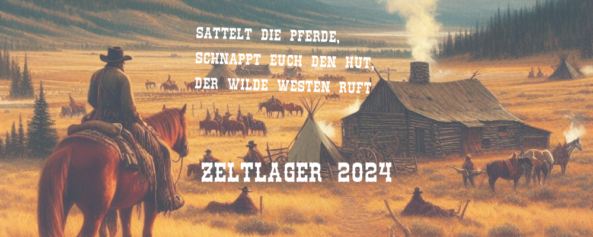

+++
title = "Zela 2024 - Sattelt die Pferde, schnappt euch den Hut, der Wilde Westen ruft"
datum = "22.07.2024 - 03.08.2024"
motto = Wilder Westen
comment = Sattelt die Pferde, schnappt euch den Hut, der Wilde Westen ruft
place = 
+++

Im Sattel der Abenteuerlust und mit dem Wind der Freiheit in den Haaren, brechen wir auf zu unserem großen Zeltabenteuer im Wilden Westen. Möge das Lagerfeuer unsere Geschichten erhellen, während wir gemeinsam das wahre Wesen des Wilden Westens mit Spielen in der Gruppe oder auch in Einzelturnieren entdecken und Erinnerungen schaffen!

Die Reise geht von Montag, 22. Juli bis Samstag, 03. August.  
 
## Reisekosten in den Wilden Westen
- 1\. Kind einer Familie: 190,- €
- 2\. Kind einer Familie: 140,- €
- Jedes weitere Kind: 100,- €  
 
## Anmeldung
[Jetzt herunterladen!](./Anmeldung-2024.pdf)
Schicke deine Anmeldung direkt per E-Mail an info@zela-od.de
oder per Post an:
Zeltlager der kath. Jugend  
Vicelinstr. 1  
23843 Bad Oldesloe

Hier nochmal die gesamte [Einladung](./Einladung-Zeltlager-2024.pdf)  
   
## Noch Fragen?
Schreiben Sie uns einfach per Email an lagerleiter@zela-od.de  
 
## Zeltlagerfreunde e.V.
Angesichts der starken Preissteigerungen freuen wir uns besonders über Ihre Unterstützung:
Verein der Zeltlagerfreunde e.V.
DE24 2019 0109 0041 3239 40
