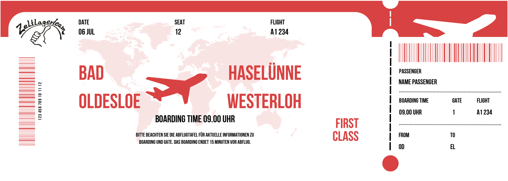

+++
title = "Zela 2026 - Eine Weltreise rund um den Globus"
[extra]
datum = "06.07 bis 18.07.2026"
motto = "Weltreise"
comment = "Eine Weltreise rund um den Globus"
place = "Westerloh"
+++

Oh nein, das Museum der Länder und Kulturen wurde ausgeraubt! 
Dabei wurden wertvolle Ausstellungsstücke aus aller Welt gestohlen -
uralte Masken, geheimnisvolle Statuen und funkelnde Schätze. 
Die Polizei tappt im Dunkeln, und das Museum bittet dringend um Hilfe.

Und jetzt kommst du ins Spiel!

Vom 06.07 bis 18.07.2026 machen wir uns gemeinsam auf den Weg, um neue Ausstellungsstücke für die Wiedereröffnung des Museums zu sammeln.

Nur mit Mut, Neugier und Teamgeist können wir die verschwundenen Schätze zurückholen. 
Dafür müssen wir auf eine große Weltreise gehen – einmal rund um den Globus!

Egal, ob du schon ein erfahrener Weltenbummler
bist oder das deine erste Große reise wird - du bist
auf jeden Fall willkommen! Also mach dich bereit
für Lagerfeuer, Spaß, Abenteuer und jede Menge
neue Freundschaften.

 

## Reisekosten ins Pilzkönigreich
- 1\. Kind einer Familie: 190,- €
- 2\. Kind einer Familie: 140,- €
- Jedes weitere Kind: 100,- €  
   
## Anmeldung
[Jetzt herunterladen!](./Anmeldung-2026.pdf)
Schicke deine Anmeldung direkt per E-Mail an <info@zela-od.de>

Hier nochmal die gesamte [Einladung](./Einladung-2026.pdf)  
   
## Noch Fragen?
Schreiben Sie uns einfach per Email an <lagerleiter@zela-od.de>  
 
## Zeltlagerfreunde e.V.
Angesichts der starken Preissteigerungen freuen wir uns besonders über Ihre Unterstützung:
Verein der Zeltlagerfreunde e.V.
DE24 2019 0109 0041 3239 40
